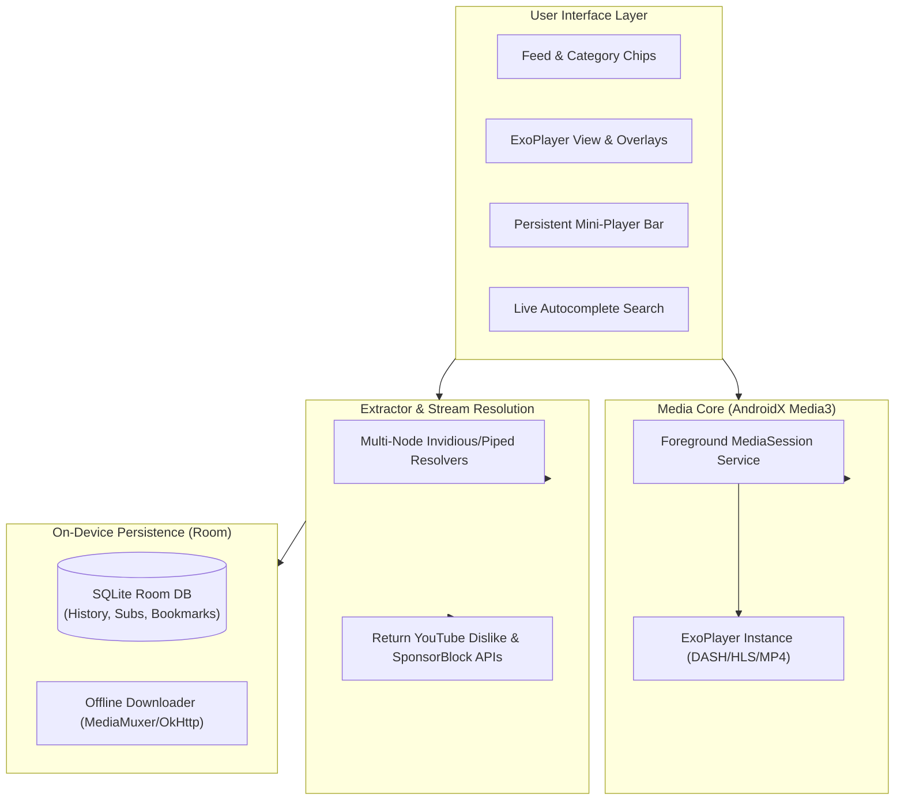

# PersonalTube (AeroTube) — Personal Ad-Free YouTube Android Client

[](https://android.com)
[](https://kotlinlang.org)
[](https://developer.android.com/media/media3)
[](LICENSE)

**PersonalTube** is a high-performance, native YouTube-like Android client designed specifically for private, personal use. It eliminates client-side video ads, enables background audio playback with lock screen media controls, supports Picture-in-Picture (PiP), skips sponsored segments, restores dislike counts, and keeps your watch history and subscriptions 100% private in a local encrypted database.

---

## ⚡ Direct Download
Pre-compiled APK is ready to install:
📦 **[Download PersonalTube-v1.0.0.apk](release/PersonalTube-v1.0.0.apk)** (~10.5 MB)

---

## 🚀 Key Features

- **🚫 100% Ad-Free Video Streaming**: Direct stream demuxing bypasses all client-side video ads and tracking beacons.
- **🎧 Background Audio & Lock Screen Playback**: Custom `PlaybackService` (`FOREGROUND_SERVICE_MEDIA_PLAYBACK`) keeps audio playing when your screen turns off or while multitasking.
- **🖼️ Picture-in-Picture (PiP)**: Seamless transition into a floating resizable player when navigating home or tapping the PiP icon.
- **⏭️ SponsorBlock Integration**: Automatically detects and skips sponsored segments, intro animations, and end cards.
- **👎 Return YouTube Dislike (RYD)**: Live integration with RYD API to display accurate like and dislike counts.
- **🔍 Instant Autocomplete Search**: Real-time suggestion engine with fast result filtering.
- **💾 Local Privacy Vault (Room Database)**:
  - Watch History with resume position tracking.
  - Channel Subscriptions without needing a Google Account.
  - Watch Later / Bookmarks.
  - Zero telemetry or cloud tracking.
- **📥 Offline Video & Audio Downloader**: Download streams directly to device storage for offline playback.
- **⚙️ Granular Player Controls**:
  - Quality Switcher: 1080p, 720p, 480p, 360p, and Audio-Only mode.
  - Playback Speed: 0.5x, 0.75x, 1.0x, 1.25x, 1.5x, 2.0x.
  - Quick Seek: Double tap left/right for 10-second rewind/fast-forward.
- **🔗 Deep Link Support**: Open any `youtube.com` or `youtu.be` link directly into PersonalTube from WhatsApp, Telegram, or your browser.

---

## 📐 Architecture & Technology Stack



| Layer | Technology |
| :--- | :--- |
| **Language** | Kotlin 1.9.22 |
| **UI Toolkit** | AndroidX Material 3 + ViewBinding |
| **Media Player** | AndroidX Media3 ExoPlayer 1.3.1 |
| **Local Database**| AndroidX Room 2.6.1 (SQLite) |
| **Networking** | OkHttp 4.12.0 + Gson 2.10.1 |
| **Image Pipeline** | Glide 4.16.0 with Disk LRU Cache |
| **Build System** | Gradle 8.7 + AGP 8.5.1 |
| **Min / Target SDK**| Min SDK 26 (Android 8.0) / Target SDK 34 (Android 14) |

---

## 🛠️ Building From Source

```bash
# Clone the repository
git clone https://github.com/ashirvadraj/PersonalTube.git
cd PersonalTube

# Build debug APK
./gradlew assembleDebug

# Output APK will be located at:
# app/build/outputs/apk/debug/PersonalTube-v1.0.0.apk
```

---

## 📄 License
This project is built for educational and personal private use. Distributed under the MIT License.
